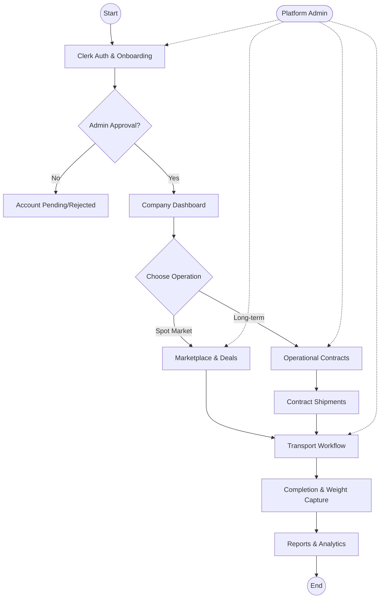
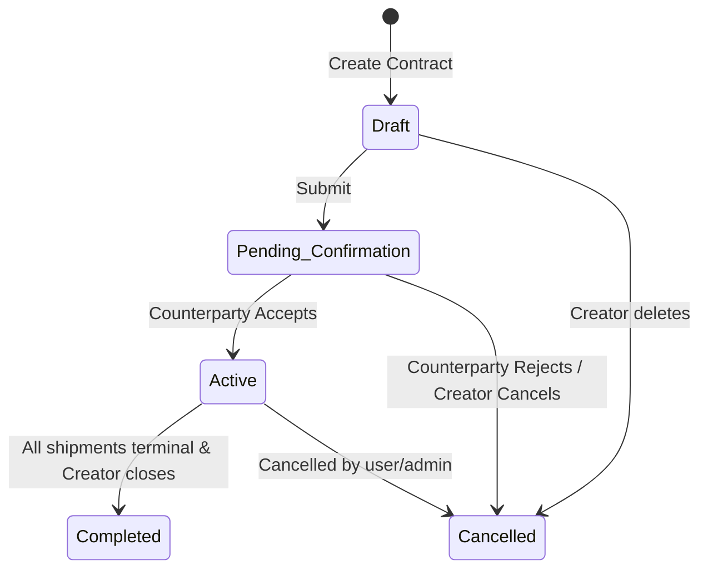
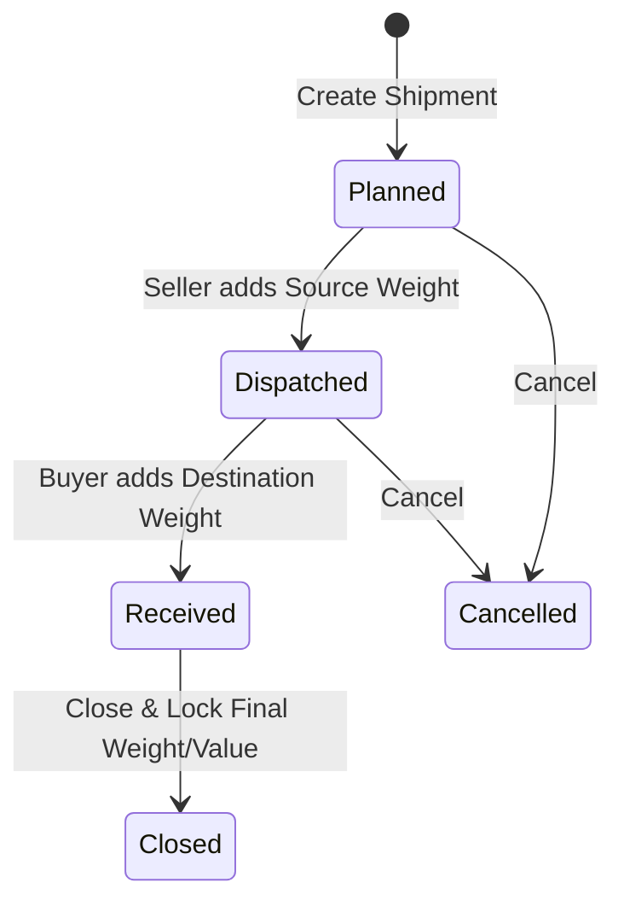
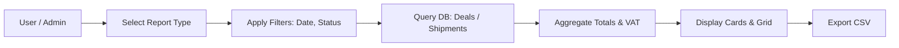
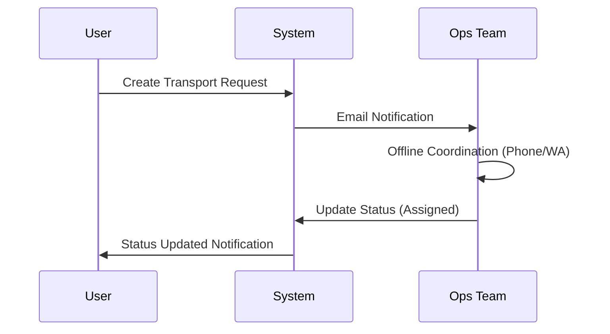
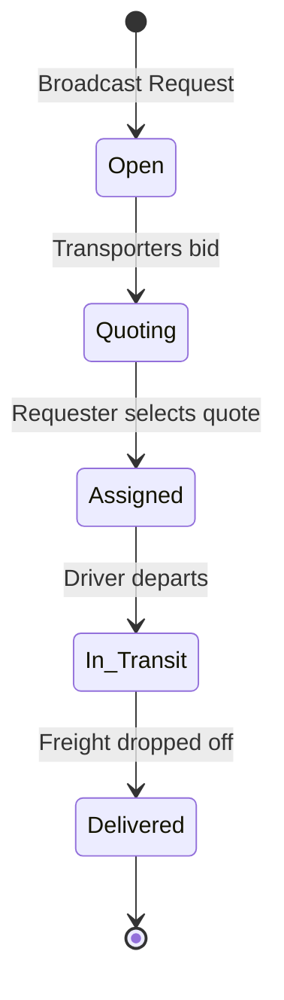
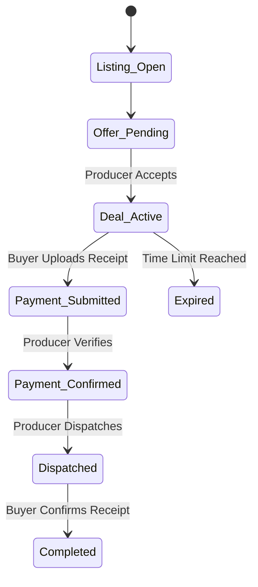
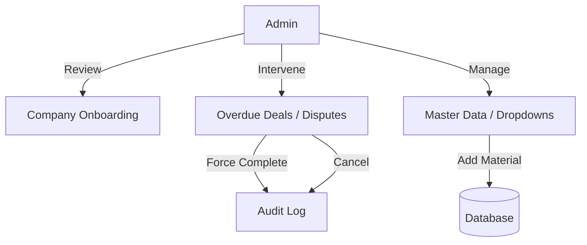
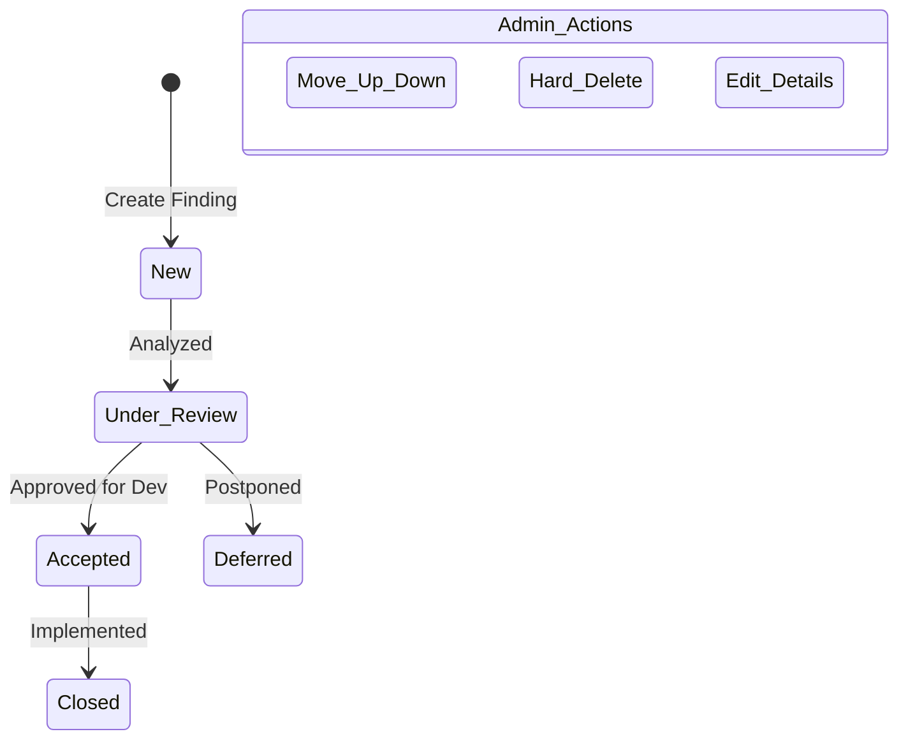
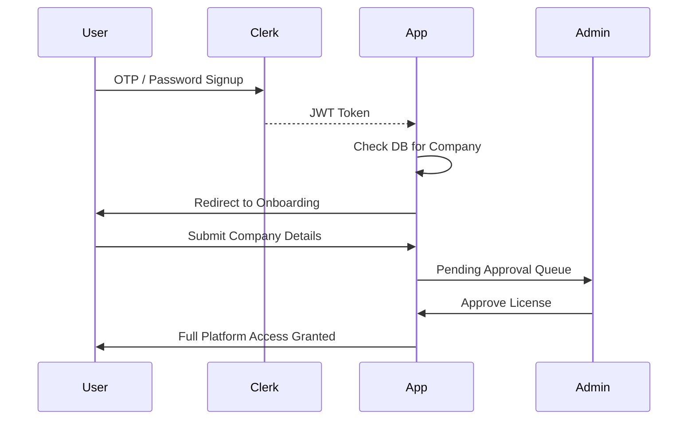

# Tadweerah Hub — Workflow Architecture

هذه الوثيقة تمثل المرجع الأساسي لهندسة الإجراءات (Workflow Architecture) في منصة تدويرة. تغطي الوثيقة جميع الخدمات والوحدات، مفصولة بين ما هو منفذ حالياً (Current) وما هو مقترح مستقبلاً (Proposed).

---

## 1. Platform Master Workflow
**Service Name:** Platform Master Workflow  
**Objective:** تقديم خريطة عامة وشاملة لرحلة المستخدم داخل المنصة وتفاعل الأنظمة مع بعضها.  
**Actors:** زائر (Visitor)، شركة منتجة (Producer)، شركة مشترية/مصنع (Buyer/Factory)، شركة نقل (Transporter)، مدير المنصة (Admin).  
**Trigger / Starting Point:** وصول المستخدم إلى المنصة وتسجيل الدخول.  
**Step-by-step process:**
1. **Onboarding:** التسجيل عبر Clerk، إكمال ملف الشركة (التراخيص والقدرات)، وموافقة الأدمن.
2. **Operations Choice:** تختار الشركة العمل عبر السوق الفوري (Marketplace) أو عبر العقود التشغيلية (Contracts).
3. **Execution:** تنفيذ الصفقات أو شحنات العقود.
4. **Logistics:** طلب النقل وتنفيذه.
5. **Closure:** اكتمال العملية (إصدار بوالص، تحديث التقارير، التسوية).
6. **Reporting & Monitoring:** عرض التقارير الدورية (للشركات) ومراقبة العمليات (للأدمن).

**Decision Points:**
- هل الشركة منتجة أم مصنع أم ناقل؟
- هل نوع التعامل صفقة فورية أم عقد طويل الأجل؟

**Current Implemented Scope:** Onboarding، Marketplace، Deals، Contract Lite، Admin overview.  
**Future Proposed Enhancements:** ربط آلي متكامل مع "مِراس" أو الجهات الحكومية للتسجيل الآلي، وتفعيل سوق الناقلين.  
**Risks / Notes:** تعدد مسارات المستخدم يتطلب واجهة Dashboard ذكية توجه المستخدم للمسار الصحيح.

---

## 2. Operational Contracts (Contract Lite)
**Service Name:** Operational Contracts  
**Objective:** إدارة العقود التشغيلية المباشرة (B2B) لتبادل المواد على فترات طويلة بدون الحاجة لسوق مفتوح.  
**Actors:** منشئ العقد (المنتج أو المشتري)، الطرف الآخر (Counterparty).  
**Trigger / Starting Point:** اتفاق خارجي بين شركتين على توريد كميات متكررة.  
**Step-by-step process:**
1. يقوم أحد الطرفين بإنشاء مسودة العقد (Draft) وتحديد سياسة الوزن.
2. إضافة بنود المواد (Material Lines) بالأسعار والنسب.
3. إرسال العقد للطرف الآخر للموافقة (Pending Confirmation).
4. يوافق الطرف الآخر فيصبح العقد فعالاً (Active).
5. يتم تنفيذ الشحنات على العقد.
6. يُغلق العقد يدوياً عند الانتهاء (Completed).

**Decision Points:**
- سياسة الوزن المعتمدة (Source vs Destination vs Higher).
- من هو البائع ومن هو المشتري؟

**Statuses:** `draft`, `pending_confirmation`, `active`, `completed`, `cancelled`.  
**Required Data:** الشركة المقابلة، المواد، سياسة الوزن، تاريخ الانتهاء (اختياري)، السعر.  
**Outputs:** Contract Reference (e.g. `TDW-CTR-YYYY-NNNN`).  
**Current Implemented Scope:** مسار العقد بالكامل (Draft to Active)، إضافة المواد، إلغاء العقد.  
**Future Proposed Enhancements:** تجديد العقد تلقائياً، تنبيهات قرب انتهاء العقد.  
**Risks / Notes:** لا يتم إغلاق العقد تلقائياً.

---

## 3. Shipments and Weight Capture
**Service Name:** Contract Shipments  
**Objective:** إدارة حركة الشحنات الفردية داخل العقد واحتساب الوزن النهائي والقيمة المالية بناءً على سياسة العقد.  
**Actors:** البائع (Seller)، المشتري (Buyer).  
**Trigger / Starting Point:** وجود عقد فعال (Active Contract).  
**Step-by-step process:**
1. إنشاء شحنة مجدولة (Planned).
2. البائع يضيف "وزن المصدر" ويؤكد الإرسال (Dispatched).
3. المشتري يضيف "وزن الوجهة" ويؤكد الاستلام (Received).
4. إغلاق الشحنة (Closed)، حيث يقوم النظام آلياً باحتساب `final_weight` و `final_value` بناءً على سياسة وزن العقد.

**Decision Points:**
- هل تم إدخال الأوزان المطلوبة قبل إغلاق الشحنة؟

**Statuses:** `planned`, `dispatched`, `received`, `closed`, `cancelled`.  
**Required Data:** وزن المصدر، وزن الوجهة، رقم البوليصة.  
**Outputs:** Final Weight, Final Value.  
**Current Implemented Scope:** دورة الشحنة بالكامل مدعومة بـ 5 سياسات وزن مختلفة.  
**Future Proposed Enhancements:** ربط الأوزان مع حساسات الميزان (IoT Scale Integration)، أو الربط مع أنظمة ERP الخاصة بالشركات.  
**Risks / Notes:** بمجرد تحول الشحنة إلى `closed`، تصبح الأوزان والقيمة النهائية غير قابلة للتعديل (Immutable) لضمان النزاهة المالية.

---

## 4. Reports Engine
**Service Name:** Data Reports & Analytics  
**Objective:** توفير لوحات معلومات وتقارير قابلة للتصدير تلخص العمليات للمستخدمين وللإدارة.  
**Actors:** مستخدم الشركة (Company Member)، مدير المنصة (Admin).  
**Trigger / Starting Point:** الدخول إلى تبويب التقارير `/reports`.  
**Step-by-step process:**
1. يختار المستخدم نوع التقرير (صفقات، شحنات عقود، إلخ).
2. يطبق فلاتر التاريخ (من - إلى) والحالة.
3. يحسب النظام الإجماليات (الوزن، القيمة، الضرائب).
4. تصدير النتائج لملف CSV عند الحاجة.

**Required Data:** تواريخ العمليات (closed_at, completed_at)، القيم النهائية، الضرائب.  
**Outputs:** Data Grids, Aggregate Cards, CSV file.  
**Current Implemented Scope:** تقارير الصفقات، وتقارير الشحنات للعقود.  
**Future Proposed Enhancements:** Phase 2-G&H (فصل رسوم تدويرة لتظهر في تقرير إداري منفصل كـ Billing Claims).  
**Risks / Notes:** التقارير تعتمد على التواريخ النهائية لإغلاق العمليات (Closed/Completed) لتجنب تغير الأرقام بعد إعداد التقرير.

---

## 5. Current Transport Workflow
**Service Name:** Offline-Assisted Transport Request  
**Objective:** تسهيل طلب شاحنات للعمليات قبل إطلاق سوق الناقلين المتكامل.  
**Actors:** طالب النقل (Requester)، فريق عمليات تدويرة (Admin Ops).  
**Trigger / Starting Point:** الصفقة تتطلب نقلاً والمستخدم يضغط "طلب نقل".  
**Step-by-step process:**
1. المستخدم ينشئ طلب نقل بمعلومات الشحنة والموقع.
2. النظام يسجل الطلب ويرسل إشعار بريدي لفريق عمليات تدويرة.
3. فريق العمليات يتواصل يدوياً (هاتف/واتساب) مع الناقلين.
4. فريق العمليات يحدث حالة الطلب في لوحة الأدمن.

**Statuses:** `pending`, `assigned`, `in_transit`, `completed`, `cancelled`.  
**Required Data:** Pickup, Dropoff, Material specs, Vehicle requirements.  
**Outputs:** Admin notification.  
**Current Implemented Scope:** تسجيل الطلب، لوحة أدمن بسيطة، إشعار بريدي.  
**Future Proposed Enhancements:** سيتم استبداله بـ Proposed Transport Marketplace.  
**Risks / Notes:** عمل يدوي مكثف على فريق العمليات، لا يوجد تتبع حي.

---

## 6. Proposed Transport Marketplace
**Service Name:** Automated Transport Marketplace  
**Objective:** أتمتة إسناد الرحلات للناقلين عبر نظام مزايدات وعروض أسعار.  
**Actors:** طالب النقل، الناقل (Transporter)، الأدمن.  
**Trigger / Starting Point:** إنشاء طلب نقل من صفقة أو عقد.  
**Step-by-step process:**
1. **Request:** المستخدم ينشئ طلب نقل وتُرسل إشعارات للناقلين المعتمدين.
2. **Quoting:** الناقلون يقدمون عروض أسعار (Quotes).
3. **Selection:** طالب النقل يراجع العروض ويختار أحدها.
4. **Execution:** يتم إرسال بيانات السائق والمركبة.
5. **Tracking:** تحديثات حية (في الطريق، وصل، تم التسليم).
6. **Settlement:** اعتماد البوليصة وتأكيد الإنجاز.

**Statuses:** Request: `open`, `quoting`, `assigned`, `in_transit`, `delivered`. Quote: `pending`, `accepted`, `rejected`.  
**Required Data:** العروض المالية، بيانات السائقين.  
**Outputs:** بوليصة النقل الإلكترونية، إسناد آلي.  
**Current Implemented Scope:** ❌ غير منفذ (التصميم والهيكلة جاهزة للبدء لاحقاً).  
**Future Proposed Enhancements:** تتبع مسار الشاحنة عبر GPS.  
**Risks / Notes:** يتطلب تسجيل واعتماد شركات نقل كافية في المنصة لتلبية الطلبات.

---

## 7. Marketplace and Deals
**Service Name:** Spot Marketplace & Deal State Machine  
**Objective:** إدارة سوق العرض والطلب المفتوح وتحويل العروض إلى صفقات مالية.  
**Actors:** المنتج، المشتري.  
**Trigger / Starting Point:** المنتج ينشر Listing.  
**Step-by-step process:**
1. **Publish:** نشر `Waste Listing`.
2. **Offer:** المشتري يقدم `Offer`.
3. **Acceptance:** المنتج يوافق على العرض فتتولد `Deal` (حالة: `active`).
4. **Payment:** المشتري يرفع إيصال الدفع (`payment_submitted`).
5. **Confirmation:** المنتج يؤكد استلام المبلغ (`payment_confirmed`).
6. **Dispatch:** المنتج يرسل الشحنة ويدخل الأوزان/بيانات المركبة (`dispatched`).
7. **Receipt:** المشتري يؤكد الاستلام.
8. **Completion:** اكتمال الصفقة (`completed`).

**Decision Points:** نوع التسوية (Fixed vs By Weight)، حاجة النقل.  
**Statuses:** `active`, `payment_submitted`, `payment_confirmed`, `dispatched`, `receipt_pending`, `completed`, `cancelled`, `expired`.  
**Required Data:** كمية، سعر، إيصال، بيانات مركبة، وقت التنفيذ.  
**Current Implemented Scope:** مسار الصفقة بالكامل منفذ ويخضع لتحذيرات انتهاء الصلاحية الآلية.  
**Future Proposed Enhancements:** ربط بوابات دفع إلكترونية B2B بدلاً من الإيصالات اليدوية.  
**Risks / Notes:** انتهاء مهلة الـ 48 ساعة للاستلام يحيل الصفقة للأدمن للتدخل.

---

## 8. Admin Operations
**Service Name:** Platform Administration & Governance  
**Objective:** الإشراف على المنصة، التدخل في النزاعات، وإدارة البيانات الوصفية (Master Data).  
**Actors:** Admin.  
**Trigger / Starting Point:** وصول الأدمن إلى `/admin`.  
**Step-by-step process:**
1. **Governance:** تفعيل حسابات الشركات وتوثيق تراخيصها.
2. **Operations Interventions:** استعراض العمليات المتأخرة، وإجبار إكمال (`force-complete`) أو الإلغاء في حال النزاعات.
3. **Master Data Management:** إضافة وتعديل قوائم المواد، الوحدات، وفئات الشركات.
4. **Issue Resolution:** مراجعة تقارير المشاكل المرفوعة من العملاء.

**Current Implemented Scope:** واجهات التدخل في الصفقات (إلغاء، إكمال، إعادة فتح)، اعتمادات الشركات، تصدير التقارير.  
**Future Proposed Enhancements:** واجهة Master Data كاملة (Phase 3-A).  
**Risks / Notes:** أي تدخل إداري يُسجل إجبارياً في `audit_log` ولا يمكن حذفه.

---

## 9. Admin Findings & Wishlist
**Service Name:** Internal Tracker (Phase 3-A2)  
**Objective:** توثيق المتطلبات التشغيلية وملاحظات الـ UAT وأفكار التحسين داخلياً ضمن المنصة.  
**Actors:** Admin.  
**Trigger / Starting Point:** رصد ملاحظة أو طلب من جهة (مثل: القريان) يستدعي التطوير.  
**Step-by-step process:**
1. إدخال الملاحظة (العنوان، المسار، الأولوية، المصدر).
2. ترتيب الملاحظات يدوياً بالأسهم (sort_order) لتحديد الأولوية العاجلة.
3. تعديل أو تحزيم الملاحظة لاحقاً.
4. حذف الملاحظة إذا لم تعد مطلوبة.

**Statuses:** `new`, `under_review`, `accepted`, `deferred`, `closed`.  
**Required Data:** Title, Type, Area, Priority, Status.  
**Outputs:** Ranked backlog visible only to admins.  
**Current Implemented Scope:** مسار متكامل CRUD + Reorder + التعريب.  
**Future Proposed Enhancements:** لا يوجد. مصمم ليكون بسيطاً ومستقلاً.  
**Risks / Notes:** النظام معزول كلياً عن جداول العمليات الحساسة (Zero Relations).

---

## 10. Company Registration & Onboarding
**Service Name:** Registration & RBAC  
**Objective:** تسجيل وتدقيق الشركات قبل السماح لها بالتداول.  
**Actors:** زائر، Clerk Auth، Admin.  
**Trigger / Starting Point:** `/sign-up`  
**Step-by-step process:**
1. تسجيل الدخول عبر Clerk (رقم الجوال أو البريد).
2. النظام يتحقق: هل المستخدم مرتبط بشركة؟
3. إذا لا: يُوجه لصفحة `/onboarding/company` لتسجيل اسم الشركة ورقم الترخيص.
4. يتم تسجيل الشركة بحالة ترخيص `pending`.
5. الأدمن يراجع ويغير الحالة إلى `approved`.

**Current Implemented Scope:** دورة التسجيل وحظر الميزات حتى الاعتماد. وربط مسار تنبيهات البريد التشغيلي.  
**Future Proposed Enhancements:** إدارة فروع الشركة (Multi-Site) وتعدد الأدوار (RBAC).  

