# Tadweerah Workflow Architecture

> **NOTE:** This document outlines the **Architecture Intent / Target Direction** and the conceptual evolution of the platform. 
> It is **NOT** the current operational truth. 
> For the definitive, exact mapping of the platform's current behavior, please refer to: 
> `docs/Tadweerah_Operational_Truth_Workflows_v5.drawio`

## Overview & Scope
هذه الوثيقة تمثل المرجع الأساسي لهندسة الإجراءات (Workflow Architecture) والنموذج التشغيلي في منصة تدويرة. 
تلتزم الوثيقة بالفصل التام بين الإجراءات **المنفذة حالياً (Current Implemented)** وبين الإجراءات **المقترحة مستقبلاً (Proposed Future)**.

## Evolution from Phase 1 MVP to Strategic Operating Model

لقد تطور نموذج تدويرة التشغيلي في مسار نضج طبيعي ومدروس من نموذج العمل الأساسي (MVP) ليصل إلى نموذج تشغيلي استراتيجي شامل.

**1. Phase 1 MVP Focus:**
كان التركيز في المرحلة الأولى على بناء النواة التشغيلية الأساسية:
* Company onboarding.
* Marketplace listings.
* Offers and deals.
* Off-platform payment confirmation.
* Dispatch and receipt.
* Basic transport request.
* Audit/compliance readiness.

**2. Current Expanded Platform Model:**
النموذج الحالي للمنصة توسع بشكل منهجي وعملي ليشمل:
* Marketplace and deals.
* Operational contracts.
* Shipments.
* Source weight / destination weight / final weight logic.
* Operational reports.
* Admin operations.
* Admin Findings & Wishlist.

**3. Proposed Future Expansions:**
استكمالاً لمسار النضج وتلبية لاحتياجات الشركاء الاستراتيجيين (Strategic Partners)، فإن التوسعات المستقبلية المقترحة تشمل:
* Licensed Transporter Marketplace.
* Recycled Materials Marketplace.
* Advanced KPIs and analytics.
* Payment claims support.
* Team permissions and branch routing.

> **Important Note:** Current implemented workflows and proposed future workflows are intentionally separated throughout this document to avoid presenting future concepts as live platform features.

## مصطلحات المنصة المعتمدة
* تدويرة (Tadweerah)
* الشريك الاستراتيجي (Strategic Partner)
* المصدر / مولد النفايات (Generator / Source)
* المعالج / شركة إعادة التدوير (Recycler / Processor)
* المشتري (Buyer)
* الناقل المرخص / الناقل المؤهل (Licensed/Qualified Transporter)
* الأدمن (Admin)
* فريق الشركة (Company Team)
* المواد المعاد تدويرها (Recycled Materials)

---

## Current vs Future Scope Map

### 🟢 Current Implemented Scope
الإجراءات المتوفرة والمنفذة فعلياً في المنصة:
1. التسجيل والاعتماد (Registration & Onboarding)
2. السوق الحالي الفوري (Spot Marketplace)
3. العروض والصفقات (Offers & Deals)
4. العقود التشغيلية (Operational Contracts)
5. الشحنات والأوزان (Shipments & Weight Capture)
6. التقارير التشغيلية (Operational Reports)
7. مسار النقل الحالي المساعد (Offline-Assisted Transport)
8. العمليات الإدارية (Admin Operations)
9. ملاحظات وتطوير (Admin Findings & Wishlist)

### 🔵 Proposed Future Scope
ميزات ومسارات مصممة ومقترحة للتطوير المستقبلي:
1. سوق الناقلين المرخصين المتمت (Licensed Transporter Marketplace)
2. سوق المواد المعاد تدويرها (Recycled Materials Marketplace)
3. مؤشرات الأداء المتقدمة والتحليلات (Advanced KPIs / Analytics)
4. مطالبات السداد والفوترة (Payment Claims / Billing Support)
5. صلاحيات الفريق التفصيلية وتوجيه الفروع (Team Permissions & Branch Routing)

---

# Part 1: Current Implemented Workflows

## 1. Platform Master Workflow
**Objective:** تقديم خريطة عامة لرحلة المستخدم وتفاعل الأنظمة ضمن النطاق المنفذ حالياً.  
**Actors:** مولد النفايات، المعالج، المشتري، الناقل، الأدمن.  
**Trigger:** وصول المستخدم للمنصة وتسجيل الدخول.  
**Current Implemented Steps:**
1. التسجيل واعتماد الحساب من الأدمن.
2. اختيار العمل عبر مسار السوق الفوري أو العقود التشغيلية.
3. تنفيذ العملية (صفقة أو شحنة عقد).
4. تسليم المواد عبر النقل.
5. إصدار تقارير العمليات.
**Decision Points:** هل الشركة منتجة أم مصنع أم ناقل؟ مسار العمل فوري أم مجدول؟  
**Statuses:** N/A (Overview).  
**Required Data:** التراخيص، الملف التعريفي.  
**Outputs:** حساب مفعل متصل بمسارات التشغيل.  
**Current Implemented Scope:** مسارات كاملة من التسجيل وحتى التقارير الأساسية.  
**Proposed Future Enhancements:** N/A (Overview).  
**Risks / Notes:** تنوع المسارات يتطلب Dashboard واضحة لتوجيه المستخدم.

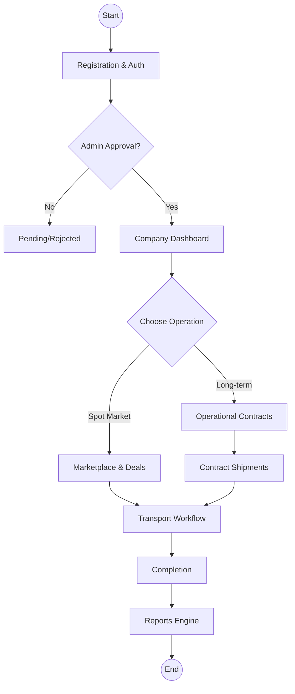

---

## 2. Company Registration & Onboarding
**Objective:** تسجيل وتدقيق الشركات والتحقق من التراخيص.  
**Actors:** زائر، Clerk Auth، الأدمن.  
**Trigger:** النقر على "إنشاء حساب".  
**Current Implemented Steps:**
1. التسجيل بـ OTP أو كلمة مرور عبر Clerk.
2. توجيه لصفحة إكمال بيانات الشركة.
3. إرسال الطلب (Pending).
4. مراجعة الأدمن واعتماد الترخيص (Approved).
**Decision Points:** هل توجد أوراق اعتماد رسمية صحيحة؟  
**Statuses:** `pending`, `approved`, `rejected`.  
**Required Data:** اسم الشركة، رقم الترخيص.  
**Outputs:** حساب شركة فعال (Active Company Profile).  
**Current Implemented Scope:** دورة التسجيل وحجب الخدمات لحين الاعتماد.  
**Proposed Future Enhancements:** الربط مع الجهات الرسمية لتوثيق التراخيص آلياً.  
**Risks / Notes:** التسجيل محصور بمالك الحساب حالياً.

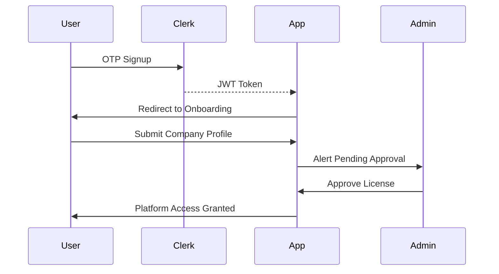

---

## 3. Marketplace Listings Workflow
**Objective:** عرض النفايات والمواد المتاحة للتداول الفوري.  
**Actors:** المصدر / مولد النفايات.  
**Trigger:** رغبة المولد في بيع أو التخلص من كمية معينة.  
**Current Implemented Steps:**
1. إنشاء Listing وتحديد المواصفات (الكمية، المادة، الصور).
2. نشر الـ Listing في السوق.
3. انتظار العروض.
**Decision Points:** هل المادة تتطلب تصريحاً خاصاً للمعالجة؟  
**Statuses:** `open`, `filled`, `expired`, `cancelled`.  
**Required Data:** المادة، الوحدة، الكمية، الموقع.  
**Outputs:** إعلان عام متاح للمشترين المؤهلين.  
**Current Implemented Scope:** مسار متكامل لإنشاء العروض مع إشعارات بريدية.  
**Proposed Future Enhancements:** مزايدات علنية (Auctions) بوقت محدد.  
**Risks / Notes:** المادة المعروضة تُحجب تلقائياً عند انتهاء صلاحية العرض.

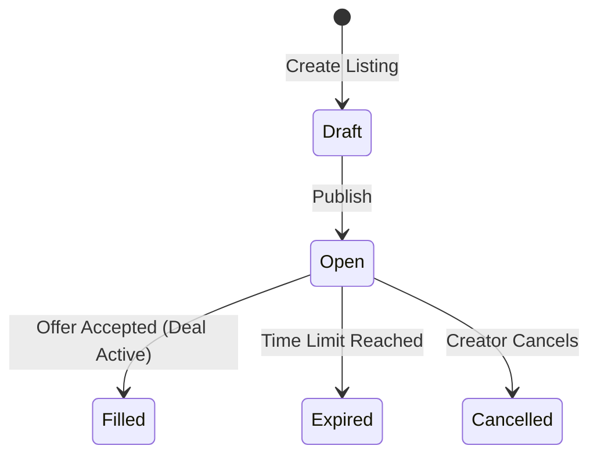

---

## 4. Offers & Deals Workflow
**Objective:** تحويل العروض في السوق إلى صفقات مالية ملزمة وحركية.  
**Actors:** المصدر / مولد النفايات، المشتري، الأدمن.  
**Trigger:** المشتري يرسل عرضاً (Offer) على Listing مفتوح.  
**Current Implemented Steps:**
1. المولد يقبل العرض فتتولد صفقة (Deal).
2. المشتري يرفع إثبات التحويل المالي.
3. المولد يؤكد استلام المبلغ.
4. المولد يشحن المواد (Dispatched).
5. المشتري يؤكد الاستلام (Completed).
**Decision Points:** القبول أو الرفض للعرض، تطابق الاستلام مع الكمية.  
**Statuses:** `active`, `payment_submitted`, `payment_confirmed`, `dispatched`, `receipt_pending`, `completed`, `cancelled`.  
**Required Data:** السعر المتفق عليه، إيصال التحويل، بوليصة النقل.  
**Outputs:** صفقة موثقة مع تقرير.  
**Current Implemented Scope:** دورة حياة كاملة مع تحذيرات انقضاء المهلة.  
**Proposed Future Enhancements:** بوابات دفع إلكتروني B2B لدعم الحسابات المعلقة (Escrow).  
**Risks / Notes:** انقضاء 48 ساعة دون تأكيد استلام يُحيل الصفقة لتدخل الأدمن.

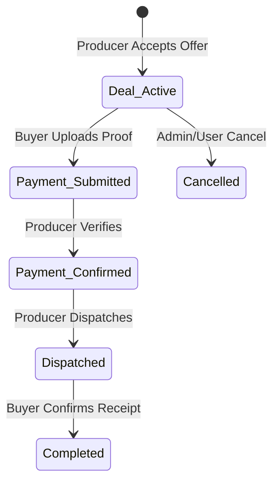

---

## 5. Operational Contracts Workflow
**Objective:** إبرام عقود B2B مجدولة خارج السوق الفوري للتدفقات المتكررة.  
**Actors:** منشئ العقد (مولد أو مشتري)، الطرف الآخر.  
**Trigger:** اتفاق مسبق بين شركتين.  
**Current Implemented Steps:**
1. إنشاء مسودة العقد وتحديد سياسة احتساب الوزن.
2. إضافة بنود المواد وتسعيرها.
3. إرسال للطرف المقابل لاعتماده.
4. الموافقة وتحول العقد لفعال (Active).
5. إغلاق العقد عند الانتهاء.
**Decision Points:** سياسة الوزن (المصدر مقابل الوجهة).  
**Statuses:** `draft`, `pending_confirmation`, `active`, `completed`, `cancelled`.  
**Required Data:** الشركة المقابلة، المواد، سياسة الوزن، تاريخ البدء والانتهاء.  
**Outputs:** وثيقة العقد المرجعية.  
**Current Implemented Scope:** مسار العقد وتحديد السياسات منفذ بالكامل.  
**Proposed Future Enhancements:** التجديد التلقائي والتنبيه قبل الانتهاء.  
**Risks / Notes:** لا تُغلق العقود تلقائياً بل تتطلب إجراءً يدوياً أو إدارياً.

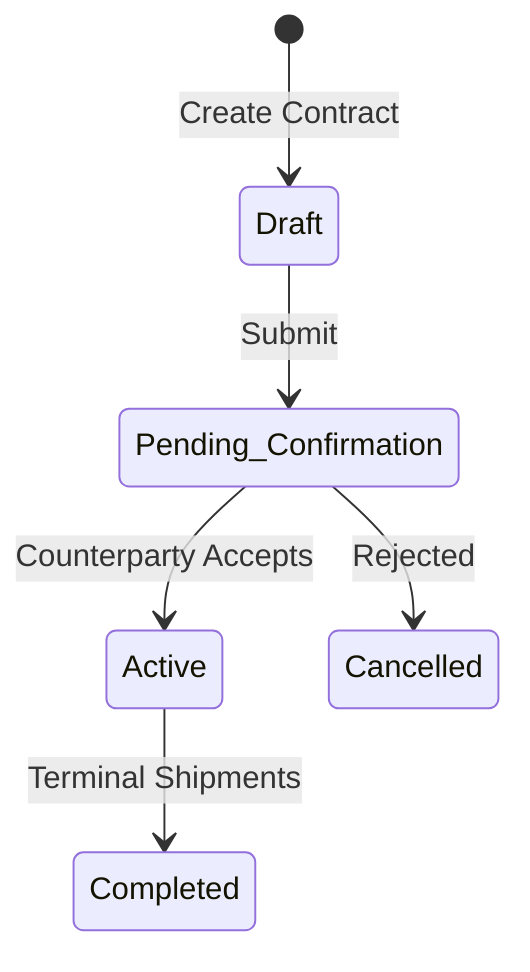

---

## 6. Shipments & Weights Workflow
**Objective:** إدارة الحركات اللوجستية التفصيلية لمواد العقود واحتساب الأوزان النهائية.  
**Actors:** مرسل الشحنة، مستقبل الشحنة.  
**Trigger:** عقد فعال يتطلب إرسال شحنة.  
**Current Implemented Steps:**
1. إنشاء شحنة مخطط لها.
2. إدخال "وزن المصدر" واعتماد الإرسال.
3. إدخال "وزن الوجهة" من المستقبل.
4. إغلاق الشحنة ليتم حساب الوزن النهائي والقيمة آلياً حسب سياسة العقد.
**Decision Points:** مطابقة الوزن المدخل مع بوليصة الشحن.  
**Statuses:** `planned`, `dispatched`, `received`, `closed`, `cancelled`.  
**Required Data:** أوزان المصدر والوجهة، إيصالات الميزان.  
**Outputs:** الوزن النهائي، القيمة المالية النهائية للشحنة.  
**Current Implemented Scope:** 5 سياسات وزن مختلفة مدعومة حالياً بالكامل.  
**Proposed Future Enhancements:** ربط آلي مع موازين الشاحنات (IoT Integration).  
**Risks / Notes:** القيم المالية ثابتة (Immutable) بمجرد تحول الشحنة لـ Closed.

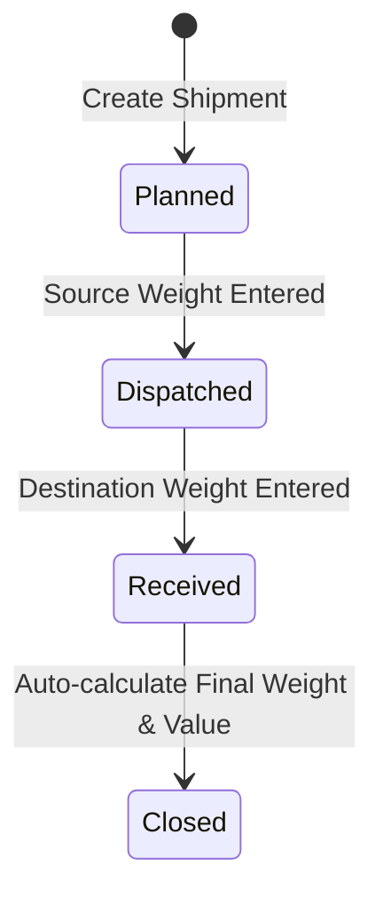

---

## 7. Reports Workflow
**Objective:** تجميع وتصدير بيانات المنصة لدعم القرار التشغيلي.  
**Actors:** فريق الشركة، الأدمن.  
**Trigger:** الدخول لتبويب التقارير.  
**Current Implemented Steps:**
1. تحديد نوع التقرير (صفقات أو شحنات عقود).
2. تطبيق فلاتر التاريخ أو المرجع.
3. عرض الإجماليات (أوزان، قيم، ضرائب).
4. التصدير لملف CSV.
**Decision Points:** N/A.  
**Statuses:** N/A.  
**Required Data:** نطاق التاريخ.  
**Outputs:** Data Cards, CSV Export.  
**Current Implemented Scope:** تقارير الصفقات والشحنات المكتملة.  
**Proposed Future Enhancements:** لوحات قياس رسوم تدويرة بشكل مستقل عن قيمة الصفقة (Billing).  
**Risks / Notes:** تعتمد حصراً على العمليات المغلقة لضمان استقرار الأرقام.

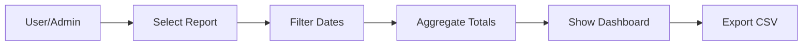

---

## 8. Current Transport Workflow
**Objective:** مساعدة لوجستية مؤقتة لترتيب النقل خارج المنصة الآلية.  
**Actors:** طالب النقل، فريق تدويرة اللوجستي (Offline).  
**Trigger:** اختيار "طلب نقل" من صفقة.  
**Current Implemented Steps:**
1. طلب النقل عبر النظام.
2. إشعار بريدي لفريق تدويرة.
3. ترتيب فريق تدويرة للنقل هاتفياً/واتساب مع الناقلين.
4. تحديث الحالة يدوياً من قِبل الأدمن.
**Decision Points:** تسعيرة النقل وقبول المولد لها.  
**Statuses:** `pending`, `assigned`, `in_transit`, `completed`, `cancelled`.  
**Required Data:** موقع الاستلام والتسليم، مواصفات الحمولة.  
**Outputs:** إشعار بريدي.  
**Current Implemented Scope:** نموذج طلب مبسط لتسجيل الاحتياج.  
**Proposed Future Enhancements:** سيتم استبداله بسوق الناقلين المرخصين بالكامل (انظر Part 2).  
**Risks / Notes:** يعتمد بشكل كبير على التدخل البشري خارج المنصة.

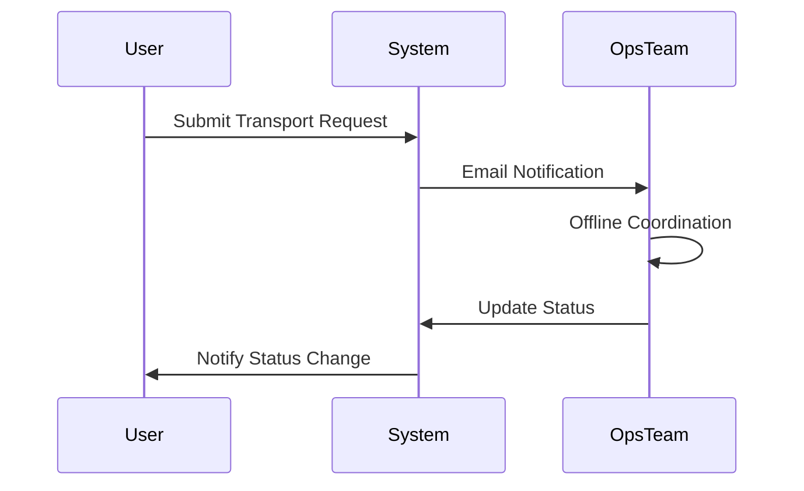

---

## 9. Admin Operations Workflow
**Objective:** رقابة المنصة والتدخل لفض النزاعات أو تجاوز العقبات التقنية.  
**Actors:** الأدمن.  
**Trigger:** تذكرة دعم أو مراقبة لوحة التحكم.  
**Current Implemented Steps:**
1. اعتماد الشركات وتحديث التراخيص.
2. التدخل في الصفقات (إجبار إكمال `force-complete`، أو إلغاء، أو إعادة فتح).
3. إدارة القوائم المنسدلة والمواد.
**Decision Points:** هل يحق للطرف المشتكي تجاوز النظام؟  
**Statuses:** N/A.  
**Required Data:** مبرر التدخل (Reason text).  
**Outputs:** إجراء إداري يُسجل في `audit_log`.  
**Current Implemented Scope:** واجهات التدخل في الصفقات وتصدير التقارير.  
**Proposed Future Enhancements:** إدارة واجهات البيانات الوصفية (Master Data) بالكامل عبر UI.  
**Risks / Notes:** كل عملية إجبارية تُسجل نهائياً للحفاظ على النزاهة.

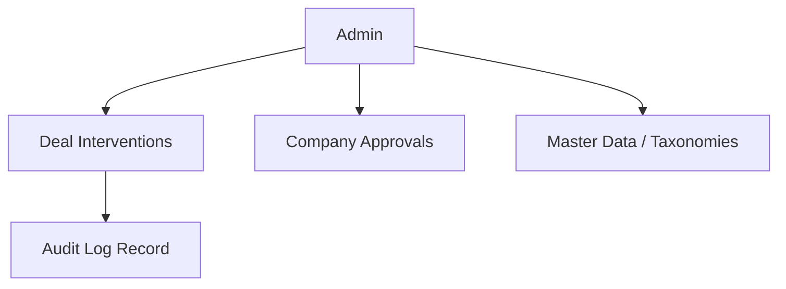

---

## 10. Admin Findings & Wishlist Workflow
**Objective:** نظام تتبع داخلي معزول لتوثيق احتياجات الشركاء الاستراتيجيين وتطوير المنصة.  
**Actors:** الأدمن.  
**Trigger:** طلب تطوير أو ملاحظة تشغيلية.  
**Current Implemented Steps:**
1. تسجيل الملاحظة (نوع، عنوان، أولوية).
2. إسناد المصدر إلى "شريك استراتيجي" أو غيره.
3. الترتيب اليدوي (Reorder) بالأسهم للأولوية القصوى.
4. إغلاق الملاحظة عند الإنجاز.
**Decision Points:** أولوية التنفيذ البرمجي.  
**Statuses:** `new`, `under_review`, `accepted`, `deferred`, `closed`.  
**Required Data:** Title, Source, Priority.  
**Outputs:** قائمة مرتبة لأولويات التطوير الداخلي.  
**Current Implemented Scope:** مسار مستقل (CRUD + Reorder) يعمل بنجاح.  
**Proposed Future Enhancements:** N/A (مصمم ليكون أداة داخلية بسيطة).  
**Risks / Notes:** لا يتصل نهائياً بجداول الصفقات (Zero Relation).

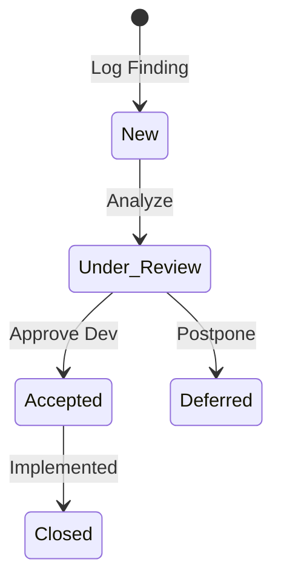

---

# Part 2: Proposed Future Workflows

> **ملاحظة هامة:** كافة التدفقات والإجراءات في هذا القسم تمثل **خارطة طريق مستقبلية ومقترحات تطوير**، وليست جزءاً من الشيفرة البرمجية الحالية في المنصة التشغيلية.

## 11. Proposed Licensed Transporter Marketplace Workflow
**Objective:** أتمتة وتوثيق إسناد مهام النقل للناقلين المرخصين ببيئة شفافة وتنافسية (Bidding Model).  
**Actors:** طالب النقل (مصدر/مشتري)، الناقل المرخص، الأدمن.  
**Trigger:** شحنة من عقد، أو صفقة فورية تتطلب ترتيب نقل لوجستي.  
**Proposed Steps:**
1. **إنشاء طلب نقل:** يحدد المستخدم نقطة الاستلام، نقطة التسليم، نوع الشاحنة المطلوبة، وتاريخ التنفيذ.
2. **تحديد الناقلين وتوجيه الطلب:** يقوم النظام بحصر كافة "الناقلين المرخصين" والمؤهلين لتلك المادة وتوجيه الإشعار لهم.
3. **استقبال العروض (Quoting):** يقدم الناقلون عروض أسعار (Bids) بناءً على تفاصيل الطلب.
4. **المقارنة والاختيار:** طالب النقل يراجع العروض ويختار الناقل الأنسب مالياً ولوجستياً.
5. **الربط والاعتماد:** يتم تعميد الناقل المختار وربطه بالشحنة.
6. **إدخال بيانات التنفيذ:** يُدخل الناقل بيانات (رقم اللوحة، هوية السائق، رخصة القيادة).
7. **تنفيذ ومتابعة النقل:** تحديث الحالة من (تم التحميل، في الطريق، تم التسليم).
8. **الإغلاق:** تسليم بوليصة النقل الإلكترونية وربط بيانات التسعير والوزن بتقرير الصفقة الأساسية.
**Decision Points:** اختيار الناقل المفضل، استبعاد العروض المتأخرة، مطابقة رخص القيادة وتصاريح النقل.  
**Statuses (Proposed):** Request (`open`, `quoting`, `assigned`, `in_transit`, `delivered`). Quote (`pending`, `accepted`, `rejected`).  
**Required Data:** العروض المالية، رخص القيادة، بطاقات التشغيل للمركبات.  
**Outputs:** بوليصة نقل موثقة إلكترونياً، إسناد آلي شفاف.  
**Current Implemented Scope:** ❌ غير منفذ. (موجود فقط كمسودة قواعد بيانات وتصميم أولي).  
**Proposed Future Enhancements:** التتبع الحي (Live GPS Tracking) للشاحنات المتجهة للمواقع، وربط البوالص آلياً مع بوابات التوزين (Weighbridges).  
**Risks / Notes:** يتطلب هذا السوق تأهيل وتسجيل شبكة ضخمة من الناقلين المرخصين لضمان كفاءة التنافس وعدم تعطل صفقات المولدين.

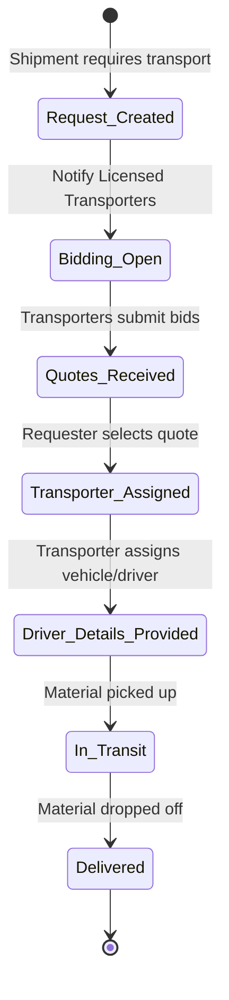

---

## 12. Proposed Recycled Materials Marketplace Workflow
**Objective:** فتح قناة تسويق ومبيعات متقدمة لـ (المواد المعاد تدويرها / الجاهزة كمواد خام)، تمثل المرحلة اللاحقة لدورة المعالجة.  
**Actors:** المعالج / شركة إعادة التدوير (كبائع)، المشتري (المصانع المحلية، أو مشترين إقليميين/عالميين).  
**Trigger:** شركة إعادة التدوير أنهت معالجة كميات وتود طرحها كـ (مواد معاد تدويرها) جاهزة للبيع التصنيعي.  
**فرق السوق الأساسي عن هذا السوق المقترح:**
* **السوق الحالي (Spot Market):** مولد/مصدر يطرح (نفايات/مخلفات) ⬅️ للمعالج.
* **السوق المقترح (Recycled Materials):** معالج يطرح (مواد خام معاد تدويرها) ⬅️ للمصنع النهائي أو المشتري العالمي.  
**Proposed Steps:**
1. المعالج يعرض (مواد معاد تدويرها) بذكر تفاصيل الجودة والنقاوة.
2. إرفاق (الشهادات الفنية والتحاليل المخبرية) للمادة ضمن الـ Listing.
3. تحديد شروط التوفر (جاهز للاستلام الفوري، أو متوفر خلال شهر).
4. يستقبل المعالج طلبات شراء (Purchase Requests) من المشترين المهتمين.
5. الموافقة وإصدار (Proforma Invoice / صفقة مبدئية).
6. ترتيب النقل عبر (سوق الناقلين المرخصين) أو نقل دولي إن لزم الأمر.
7. تسليم المواد للمصنع النهائي.
**Decision Points:** مطابقة الجودة للمصنع المشتري، الاتفاق على شهادات الفحص.  
**Statuses (Proposed):** مشابهة للسوق الحالي مع حالات إضافية لتدقيق الجودة والفحص المخبري.  
**Required Data:** شهادات المنشأ، تحاليل الجودة (Purity/Specs)، شروط التسليم (Incoterms).  
**Outputs:** صفقات مواد خام موثقة تلبي احتياجات سلاسل الإمداد العالمية أو المحلية.  
**Current Implemented Scope:** ❌ غير منفذ. المنصة الحالية تركز على سوق المولدين إلى المعالجين.  
**Proposed Future Enhancements:** مزامنة المخزون (Inventory Sync) بين مصانع التدوير والمنصة لتحديث الكميات المتاحة آلياً.  
**Risks / Notes:** يتطلب هذا السوق تصنيفات (Taxonomy) دقيقة ومختلفة كلياً عن تصنيفات "النفايات والمخلفات" المعتمدة في المراحل الأولى.

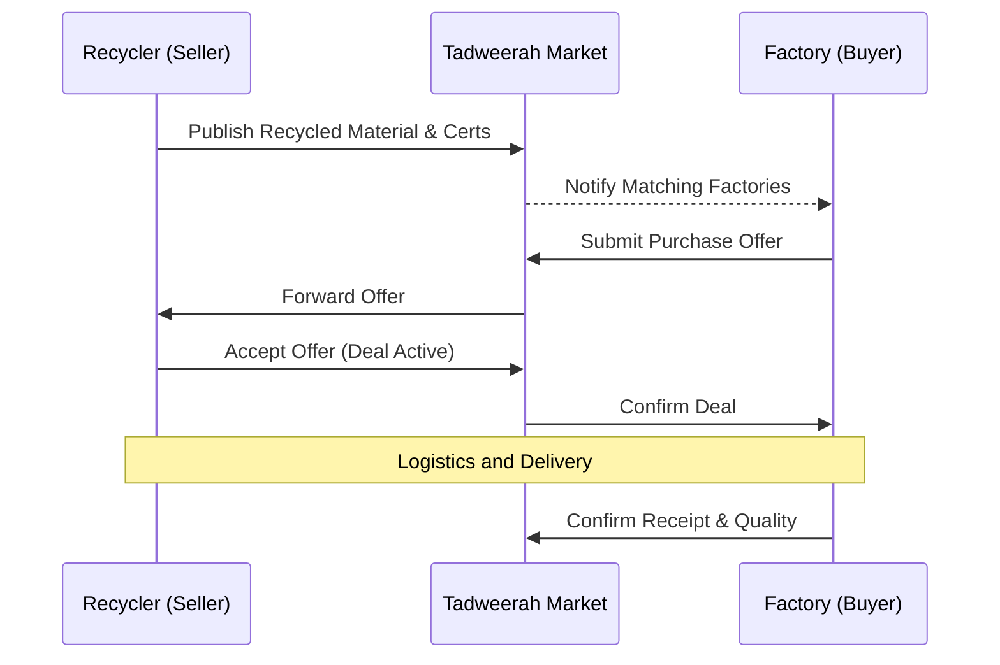

---

## 13. Future Advanced KPIs / Analytics
**Objective:** توفير تحليلات استباقية وألواح قياس ذكية للإدارة العليا والشركاء الاستراتيجيين.  
**Actors:** الأدمن، الشريك الاستراتيجي.  
**Trigger:** طلب تقرير شهري استراتيجي.  
**Proposed Steps:** تحويل بيانات العمليات المغلقة لمؤشرات اقتصادية (مثل حجم التداول السوقي، أوقات الاستجابة اللوجستية، نسب القبول للعروض).  
**Current Implemented Scope:** ❌ غير منفذ (الموجود حالياً تقارير كمية تشغيلية بسيطة).  
**Mermaid diagram:** N/A (Data Visualization Focus).

---

## 14. Future Payment Claims / Billing Support
**Objective:** فصل رسوم ومطالبات منصة تدويرة عن القيم التشغيلية لصفقات الشركات.  
**Actors:** الإدارة المالية لمنصة تدويرة، الشركات.  
**Proposed Steps:** رصد كل صفقة تمت، وتجميعها في مسودة مطالبة شهرية (Billing Statement) تُرسل آلياً للشركة لدفع رسوم وعمولات المنصة.  
**Current Implemented Scope:** ❌ غير منفذ. (موجود فقط في مستندات التصميم Phase 2-G&H).  
**Mermaid diagram:** N/A (Financial Focus).

---

## 15. Future Team Permissions and Branch Routing
**Objective:** دعم الهياكل المؤسسية الضخمة التي تملك فروعاً متعددة وفرق عمل مخصصة.  
**Actors:** مدراء حسابات الشركات.  
**Proposed Steps:** إدارة مواقع التشغيل (Branches/Sites)، وتعيين موظفين مخصصين (مثال: أمين مستودع الرياض لا يرى عقود مستودع جدة). توجيه التنبيهات وإشعارات العقود للفرع المعني مباشرة بدلاً من المالك العام.  
**Current Implemented Scope:** ❌ غير منفذ. (يوجد فقط إمكانية تعيين مستلم بريد موحد `مستلم تنبيهات البريد`).  
**Mermaid diagram:** N/A (RBAC Focus).
