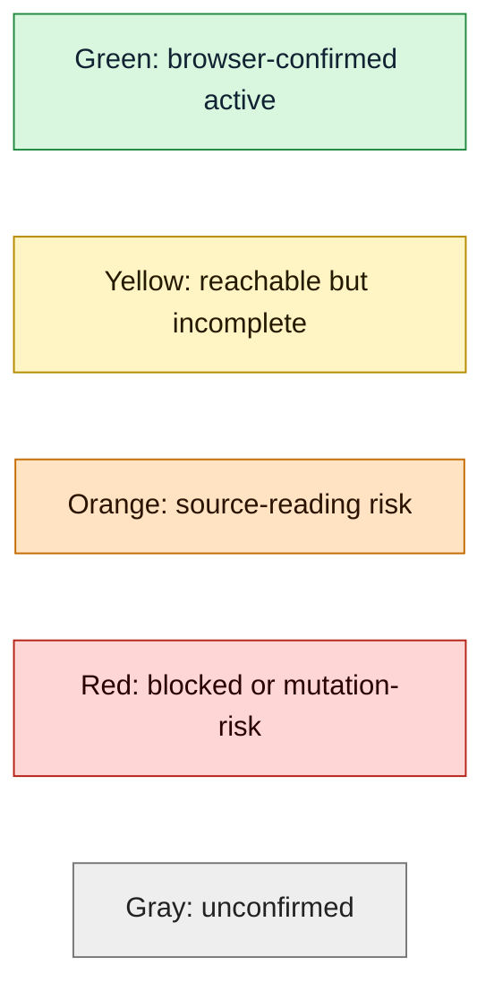
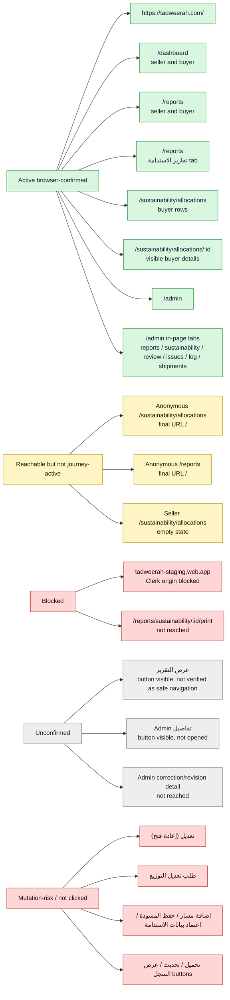
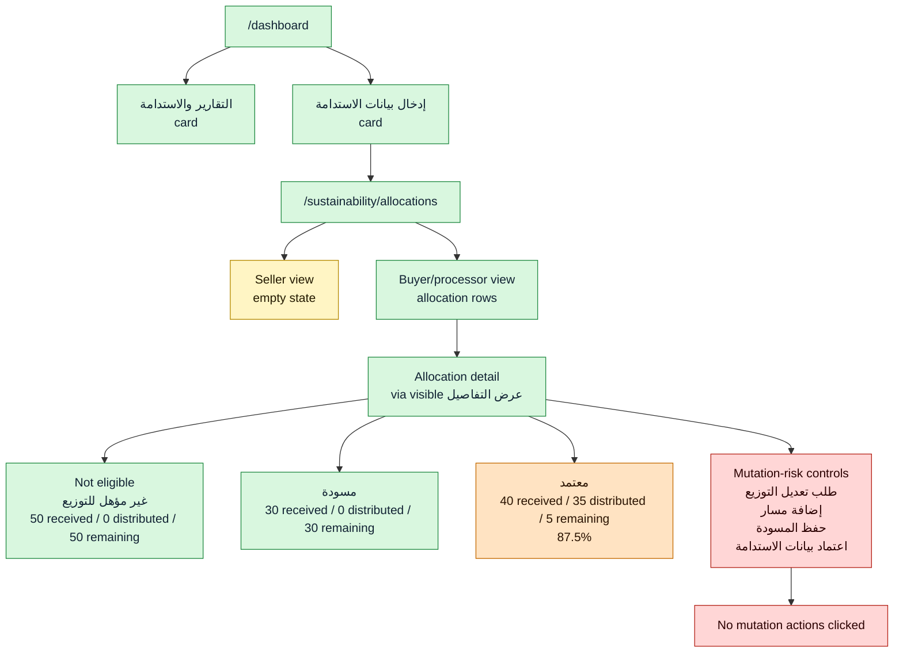
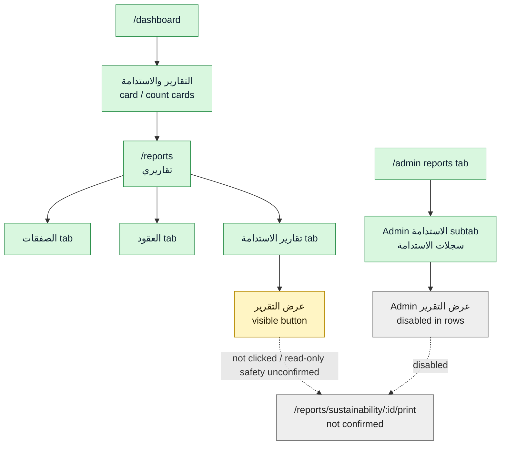
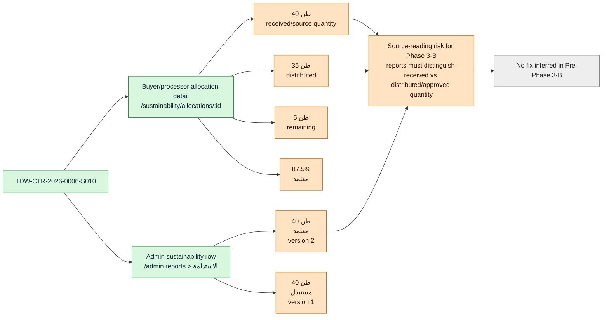
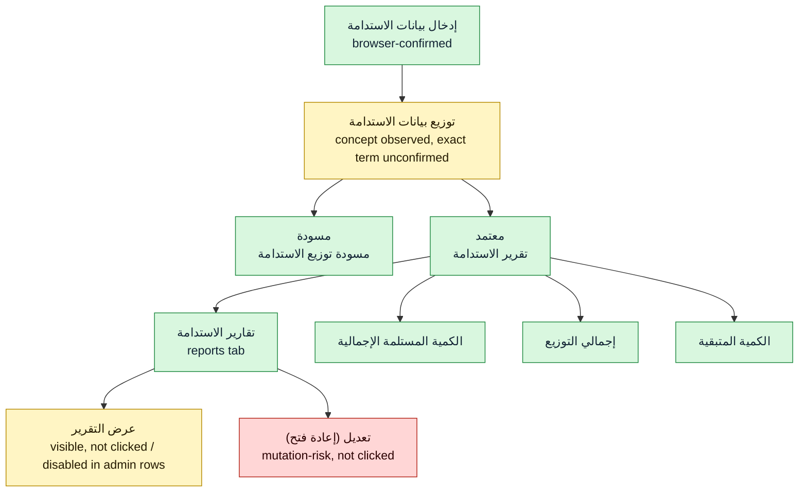

# 08A Visual Diagrams

Last updated: 2026-06-29  
Mode: Discovery Mode  
Source of truth: Mermaid diagrams in this Markdown file  
Evidence base: `02_BROWSER_JOURNEY_LOG.md` through `08_VISUAL_JOURNEY_STORYBOARD.md`

## Diagram Legend

- Green: browser-confirmed active journey
- Yellow: reachable but incomplete/empty
- Orange: visible source-reading risk
- Red: blocked or mutation-risk
- Gray: unconfirmed / not reached

## 1. Persona Journey Map

Observed facts:

- Anonymous discovery confirms public rendering only.
- Seller/producer discovery confirms report entry and an empty allocation state.
- Buyer/processor/recycler discovery confirms the active allocation journey and allocation details.
- Admin discovery confirms governance/reporting views under `/admin`.

```mermaid
flowchart TD
  anon["Anonymous\nhttps://tadweerah.com/"]
  anonHome["Public home\nRenders"]
  anonAlloc["/sustainability/allocations\nfalls back to /"]
  anonReports["/reports\nfalls back to /"]

  seller["Seller / Producer\n[TEST] Seller Demo"]
  sellerDash["/dashboard\ncards visible"]
  sellerAlloc["/sustainability/allocations\nempty state"]
  sellerReports["/reports\nتقاريري"]
  sellerSustReports["تقارير الاستدامة tab\nactive tab"]

  buyer["Buyer / Processor / Recycler\n[TEST] Buyer Demo"]
  buyerDash["/dashboard\ncards visible"]
  buyerAlloc["/sustainability/allocations\nrows visible"]
  buyerNotEligible["Allocation detail\nnot eligible\n50 / 0 / 50"]
  buyerApproved["Allocation detail\nمعتمد\n40 / 35 / 5"]
  buyerDraft["Allocation detail\nمسودة\n30 / 0 / 30"]
  buyerReports["/reports\nactive"]
  buyerSustReports["تقارير الاستدامة tab\nactive tab"]

  admin["Admin\nمدير تدويرة"]
  adminPanel["/admin\nلوحة إدارة الصفقات"]
  adminReports["Admin reports tab"]
  adminSust["Admin الاستدامة subtab\nسجلات الاستدامة"]
  adminReview["عمليات تحتاج مراجعة"]
  adminIssues["مشاكل العملاء"]
  adminLog["سجل العمليات"]

  anon --> anonHome
  anon --> anonAlloc
  anon --> anonReports

  seller --> sellerDash
  sellerDash --> sellerAlloc
  sellerDash --> sellerReports
  sellerReports --> sellerSustReports

  buyer --> buyerDash
  buyerDash --> buyerAlloc
  buyerAlloc --> buyerNotEligible
  buyerAlloc --> buyerApproved
  buyerAlloc --> buyerDraft
  buyerDash --> buyerReports
  buyerReports --> buyerSustReports

  admin --> adminPanel
  adminPanel --> adminReports
  adminReports --> adminSust
  adminPanel --> adminReview
  adminPanel --> adminIssues
  adminPanel --> adminLog

  classDef green fill:#d9f7df,stroke:#218a42,color:#123;
  classDef yellow fill:#fff5c4,stroke:#b58a00,color:#241a00;
  classDef orange fill:#ffe3c2,stroke:#c46b00,color:#2a1300;
  classDef red fill:#ffd6d6,stroke:#b42318,color:#2a0000;

  class anonHome,sellerDash,sellerReports,sellerSustReports,buyerDash,buyerAlloc,buyerNotEligible,buyerDraft,buyerReports,buyerSustReports,adminPanel,adminReports,adminSust,adminReview,adminIssues,adminLog green;
  class sellerAlloc yellow;
  class buyerApproved orange;
  class anonAlloc,anonReports red;
```

## 2. Active Route Map

Observed facts:

- Active requires browser evidence.
- Code-present alone is not classified as active.
- No route is called obsolete in this diagram.

## 3. Sustainability Allocation Flow

Observed facts:

- Seller/producer reaches the allocation route but sees an empty state.
- Buyer/processor/recycler reaches the active allocation list and detail states.
- Mutation actions were visible but not clicked.

## 4. Reports Flow

Observed facts:

- Seller and buyer can reach `/reports`.
- `تقارير الاستدامة` tab is active.
- `عرض التقرير` was visible but not clicked.
- `/reports/sustainability/:id/print` is not browser-confirmed active.

## 5. 40 / 35 / 5 Evidence Map

Observed facts:

- Buyer/processor allocation detail is the strongest evidence for the 40/35/5 split.
- Admin sustainability record shows 40 tons for the same reference.
- This is a Phase 3-B source-reading risk, not a confirmed fix.

## 6. Terminology Flow Diagram

Observed facts:

- Some requested terms are browser-confirmed exactly.
- `توزيع بيانات الاستدامة` was not observed as an exact visible phrase, but the distribution concept appears through `إجمالي التوزيع` and `مسودة توزيع الاستدامة`.
- Mutation-risk terms are shown for context only.

## Evidence References

- Anonymous/custom-domain evidence: `02_BROWSER_JOURNEY_LOG.md`, `04_CUSTOM_DOMAIN_BROWSER_DISCOVERY.md`
- URL/config evidence: `03_URL_RESOLUTION.md`
- Seller/producer evidence: `05_SELLER_PRODUCER_AUTH_DISCOVERY.md`
- Buyer/processor/recycler evidence: `06_BUYER_PROCESSOR_AUTH_DISCOVERY.md`
- Admin evidence: `07_ADMIN_AUTH_DISCOVERY.md`
- Cross-persona storyboard: `08_VISUAL_JOURNEY_STORYBOARD.md`

## Notes

- These diagrams do not classify any path as obsolete.
- These diagrams do not propose fixes.
- These diagrams do not turn Pre-Phase 3-B into Phase 3-B.
- Static PNG/PDF exports may be produced later, but this Markdown file remains the editable source of truth.
